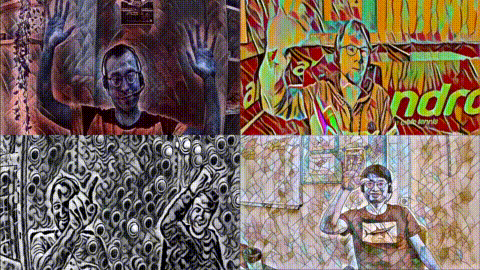
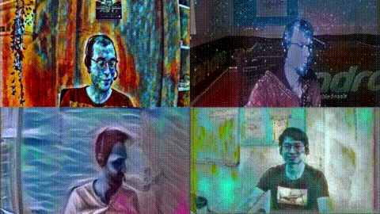

# Virtual Neural Style Transfer Webcam for Linux
Ever wanted to have cool and unique filters for your video call? You found it!  
This repository provides you a virtual linux webcam* which applies an [artistic neural style transfer](https://github.com/pytorch/examples/tree/master/fast_neural_style) to your webcam
video.   
It can be used like any other webcam in all types of video conferencing tools, such as zoom, skype, discord, teams... .   
Own styles trained with the code provided
by [artistic neural style transfer](https://github.com/pytorch/examples/tree/master/fast_neural_style)
can be used, too.  
Automatic GPU dependent TensorRT optimization is applied to achieve high frame rates.  
*Only tested with Ubuntu 18.04 and 20.04 so far.

 <table style="width:100%">
  <tr>
      <td colspan="2" align=center  ></td>
  </tr>
  <tr>
  </tr>
  <tr>
    <td></td>
    <td></td>
  </tr>

</table> 
Some recordings of zoom calls introducing a subset of the provided styles.

## Simple 5-step Installation and Launching with Docker:    
(an installation tutorial withouth using docker is given at the end of the document)

### Requirements:

1. Have a good *nvidia* graphics card with a driver of version 465.31 or newer installed.  
   Older driver versions do sometimes work but not all of them.  
   With a Geforce 2080TI I could achieve 24 fps for the artistic style transfer with a resolution of 1280x720.
2. Have Ubuntu 18.04 or 20.04  installed (it likely works also for other linux distributions but I have not tested it, yet.)  

### Installation:  
1. Install [Docker](https://docs.docker.com/engine/install/ubuntu/) `curl https://get.docker.com | sh && sudo systemctl --now enable docker`  
Install [Nvidia Docker](https://docs.nvidia.com/datacenter/cloud-native/container-toolkit/install-guide.html#docker)  
Install [docker-compose](https://docs.docker.com/compose/install/) `sudo curl -L "https://github.com/docker/compose/releases/download/1.29.1/docker-compose-$(uname -s)-$(uname -m)" -o /usr/local/bin/docker-compose && sudo chmod +x /usr/local/bin/docker-compose`
.   
Add your current user to the docker group: `sudo groupadd docker && usermod -aG docker $USER`. Than log out and log
back.

2. Download the [style models](https://u-173-c142.cs.uni-tuebingen.de/index.php/s/ierXwx3DS8X48ss).   
   Extract the file and copy the folder`style_transfer_models` to `./data` .
3. Set `VIDEO_INPUT` in `.docker/docker_compose_nvidia.yml` to your webcam device (defaults to /dev/video0).  
   Use `v4l2-ctl --list-devices` to find your device. Consider also to adapt the environment variables in this file.
4. Change to docker dir `cd *path to repository*/docker/`  
   run `docker-compose -f docker-compose-nvidia.yml build`
5. (if your linux got updated to a newer kernel at some later point, you have to run    
 `docker-compose -f docker-compose-nvidia.yml build --no-cache` to get the script working again.)

### How to start the webcam:

1. Change to docker dir `cd *path to repository*/docker/`.
2. For artistic style transfer: `docker-compose -f docker-compose-nvidia.yml  run stylecam`  .
   You might have to start it a second time when it does not find `/dev/video13`.  
   Starting the program the first time will take several minutes, since the networks are optimized to your gpu.   
   If you encounter an out of memory error during this optimization, just restart. If you encounter an error concerning
   permissions for /dev/video12 or /dev/video13 run `sudo chmod 777 /dev/video1*`
3. The new webcam device is `/dev/video12`. Test it with `fflpay /dev/video12`.

### How to stop the webcam:

1. Stop the face program with `strg c`.
2. If your real webcam input is now very slow just restart the system. (I'm working on a better solution.)

## How to change and adapt styles:

Enter 1+BACKSPACE to deactivate and activate styling  
The program can iterate over all styles provided in the artistic style tansfer model dir (-s) and in corresponding
subdirs.    
Enter 2+BACKSPACE to load the previous style  
Enter 3+BACKSPACE to load the next style  
Some style models achieve better results if the styled image is smaller or larger. This does not change the video output
size.    
Enter 4+BACKSPACE to decrease the scale factor of the model input. This will increase the frame rate.  
Enter 5+BACKSPACE to increase the scale factor of the model input This will decrease the frame rate.  
Enter 6+BACKSPACE to decrease the noise suppression factor. This might lead to annoying noise.  
Enter 7+BACKSPACE to increase the noise suppression factor. This might lead to blurred faces.  
Press CTRL-c to exit

## How to add new styles

Put additional artistic style tansfer models in the directory provided with the -s flag (defaults to
./data/style_transfer_models)
You can train own styles with the code provided
by [artistic neural style transfer](https://github.com/pytorch/examples/tree/master/fast_neural_style).

## Source and Acknowledgement

This work builds upon:  
hipersayanX's [akvcam](https://github.com/webcamoid/akvcam)    
fangfufu's  [Linux-Fake-Background-Webcam](https://github.com/fangfufu/Linux-Fake-Background-Webcam)  
[Leon Gatys et. al.'s](https://www.cv-foundation.org/openaccess/content_cvpr_2016/papers/Gatys_Image_Style_Transfer_CVPR_2016_paper.pdf)
and [Justin Johnson et. al.'s](https://arxiv.org/pdf/1603.08155.pdf) [artistic neural style transfer](https://github.com/pytorch/examples/tree/master/fast_neural_style)  
The neural style transfer programming project team of the summer semester 2020.  
Many thanks for your contributions.

## Donations
To support this project, you can make a donation to its current maintainer:  

## Long and complicated Installation without Docker:

### Requirements and Installation

1. The [akvcam](https://github.com/webcamoid/akvcam) has to be installed. Please,
   follow [their wiki](https://github.com/webcamoid/akvcam/wiki) to install it.  
   In contrast to their documentation, for (Ubuntu 18.04) the driver is located at:  
   `lib/modules/$(uname -r)/updates/dkms/akvcam.ko`
2. Copy the akvcam configuration files:   
   `sudo mkdir -p /etc/akvcam`
   `cp akvcam_config/* /etc/akvcam/`
   The akvcam output device is now located at `/dev/video3`  (this is the one you have to provide to the fakecam
   scipt)  
   The akvcam capture device is now located at `/dev/video2` (This is the one you have to choose in the software that
   displays your webcam video )
3. Have a good graphics card with driver version >465.31 installed. With a Geforce 2080TI we could achieve 24 fps for
   the artistic style tansfer a with a resolution of 1280x720
4. Install the cuda libraries with version >= [cuda 11.0](https://developer.nvidia.com/cuda-11.0-download-archive)
   installed.
5. Install tensorrt python wheels with version > 8.0.0.3
6. Install python packages given in the requirements.txt.
7. Download the [style models](https://u-173-c142.cs.uni-tuebingen.de/index.php/s/ierXwx3DS8X48ss).   
   Extract the file and copy the folders to `./data` .

### How to start the webcam withouth docker:
1. make sure the gpu driver is loaded:  
    `sudo modprobe videodev`
2. load the akvcam driver:  
   `sudo insmod /lib/modules/$(uname -r)/updates/dkms/akvcam.ko`

3. run the facecam program:  
   `python3 src/main.py -w /dev/video1 -v /dev/video3`
   -w is the path to the real webcam device (you might have to adapt this one).  
   -v is the path to the virtual akvcam output device.  
   use --help to see further options.

### How to stop the webcam withouth docker:

1. stop the face program with `strg c`

2. unload the akvcam driver
   `sudo rmmod lib/modules/$(uname -r)/updates/dkms/akvcam.ko`

