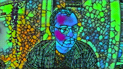
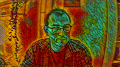
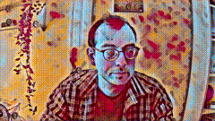
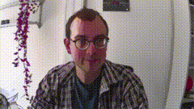
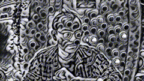
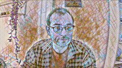
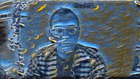
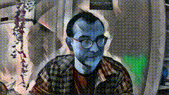
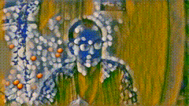

# Virtual Neural Style Transfer Webcam for Linux
Ever wanted to have cool and unique filters for your video call? You found it!  
This repository provides you a virtual linux webcam* which applies
a [artistic neural style transfer](https://github.com/pytorch/examples/tree/master/fast_neural_style) to your webcam
video.  
Own styles trained with the code provided
by [artistic neural style transfer](https://github.com/pytorch/examples/tree/master/fast_neural_style)
can be used, too.

*Only tested with ubuntu 18.04 so far.
 <table style="width:100%">
  <tr>
    <td>
    <td>
    <td>
  </tr>
    <td>
    <td>
    <td>
  </tr>
    </tr>
    <td>
    <td>
    <td>
  </tr>
</table> 

## Source and Acknowledgement

This work builds upon:  
hipersayanX [akvcam](https://github.com/webcamoid/akvcam)    
fangfufu  [Linux-Fake-Background-Webcam](https://github.com/fangfufu/Linux-Fake-Background-Webcam)  
[Leon Gatys et. al.](https://www.cv-foundation.org/openaccess/content_cvpr_2016/papers/Gatys_Image_Style_Transfer_CVPR_2016_paper.pdf)
, [Justin Johnson et. al.](https://arxiv.org/pdf/1603.08155.pdf) and the Pytorch
team [artistic neural style transfer](https://github.com/pytorch/examples/tree/master/fast_neural_style)  
Xinrui Wang et.al. ant the Tensorflow
team   [cartoon style transfer](https://github.com/SystemErrorWang/White-box-Cartoonization)   
Many thanks for their contributions.

## How to change and adapt styles:

Press CTRL-ALT-1 to deactivate and activate styling  
The program can iterate over all styles provided in the artistic style tansfer model dir (-s) and in corresponding
subdirs.    
Press CTRL-ALT-2 to load the previous style  
Press CTRL-ALT-3 to load the next style  
Some style models achieve better results if the styled image is smaller or larger. This does not change the video output
size.    
Press CTRL-ALT-4 to decrease the scale factor of the model input. This will increase the frame rate. Press CTRL-ALT-5 to
increase the scale factor of the model input This will decrease the frame rate. Please CTRL-c to exit

## How to add new styles

Put additional artistic style tansfer models in the directory provided with the -s flag (defaults to
./data/style_transfer_models)

You can train own styles with the code provided
by [artistic neural style transfer](https://github.com/pytorch/examples/tree/master/fast_neural_style)

## Installation and Starting with Docker:

### Requirements and Installation if using Docker:

1. Have a good *nvidia* graphics card and driver of version larger than 456.31 installed.  
   With a Geforce 2080TI I could achieve 24 fps for the artistic style transfer with a resolution of 1280x720.
2.
Install [Docker](https://docs.docker.com/engine/install/ubuntu/) `curl https://get.docker.com | sh && sudo systemctl --now enable docker`  
Install [Nvidia Docker](https://docs.nvidia.com/datacenter/cloud-native/container-toolkit/install-guide.html#docker)  
Install [docker-compose](https://docs.docker.com/compose/install/) `sudo curl -L "https://github.com/docker/compose/releases/download/1.29.1/docker-compose-$(uname -s)-$(uname -m)" -o /usr/local/bin/docker-compose && sudo chmod +x /usr/local/bin/docker-compose`
.   
Add your current user to the docker group: `sudo groupadd docker && usermod -aG docker $USER`. Than log out and log
back.
3. Download the [style models](https://u-173-c142.cs.uni-tuebingen.de/index.php/s/ierXwx3DS8X48ss).   
   Extract the file and copy the folder`style_transfer_models` to `./data` .
4. set `VIDEO_INPUT` in `*path to repository*/docker/.ènv` to your webcam device (defaults to /dev/video0).  
   Use `v4l2-ctl --list-devices` to find your device.
5. change to docker dir `cd *path to repository*/docker/`  
   run `docker-compose -f docker-compose-nvidia.yml build`

   `

### How to start the webcam:

1. change to docker dir `cd *path to repository*/docker/`
2. For artistic style transfer: `docker-compose -f docker-compose-nvidia.yml  run stylecam`  
   You might have to start it a second time when it does not find `/dev/video13`.
3. The new webcam device is `/dev/video12`. Test it with `fflpay /dev/video12`.

### How to stop the webcam:

1. stop the face program with `strg c`
2. if your real webcam input is now very slow just restart the system. (I'm working on a better solution.)

## Installation and Starting without  Docker:

### Requirements and Installation

1. The [akvcam](https://github.com/webcamoid/akvcam) has to be installed. Please,
   follow [their wiki](https://github.com/webcamoid/akvcam/wiki) to install it.  
   In contrast to their documentation, for (Ubuntu 18.04) the driver is located at:  
   `lib/modules/$(uname -r)/updates/dkms/akvcam.ko`
2. Copy the akvcam configuration files:   
   `sudo mkdir -p /etc/akvcam`
   `cp akvcam_config/* /etc/akvcam/`
   The akvcam output device is now located at `/dev/video3`  (this is the one you have to provide to the fakecam
   scipt)  
   The akvcam capture device is now located at `/dev/video2` (This is the one you have to choose in the software that
   displays your webcam video )
3. Have a good graphics card. With a Geforce 2080TI we could achieve 24 fps for the artistic style tansfer a with a
   resolution of 1280x720 TODO continue
4. Install the cuda libraries with version >= [cuda 11.0](https://developer.nvidia.com/cuda-11.0-download-archive)
   installed.
5. Install tensorrt python wheels with version > 8.0.0.3
5. Install python packages given in the requirements.txt.  
   torch 1.8.1 is only needed for the artistic style transfer. The other requirements are: opencv-python==4.2.0.32,
   torchvision==0.7.0, numpy==1.18.2.

8. Download the [style models](https://u-173-c142.cs.uni-tuebingen.de/index.php/s/ierXwx3DS8X48ss).   
   Extract the file and copy the folders to `./data` .

### How to start the webcam:
1. make sure the gpu driver is loaded:  
    `sudo modprobe videodev`
2. load the akvcam driver:  
   `sudo insmod /lib/modules/$(uname -r)/updates/dkms/akvcam.ko`

3. run the facecam program:  
   `python3 src/main.py --cartoonize -w /dev/video1 -v /dev/video3`  
   Remove `-cartoonize` to apply artistic style transfer.  
   -w is the path to the real webcam device (you might have to adapt this one).  
   -v is the path to the virtual akvcam output device.  
   use --help to see further options.

### How to stop the webcam:

1. stop the face program with `strg c`

2. unload the akvcam driver
   `sudo rmmod lib/modules/$(uname -r)/updates/dkms/akvcam.ko`

## License

Copyright (C) Maximus Mutschler All rights reserved. Licensed under the CC BY-NC-SA 4.0  
license (https://creativecommons.org/licenses/by-nc-sa/4.0/legalcode).  
Commercial application is prohibited, please remain this license if you clone this repo . 

    
